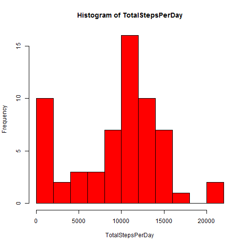
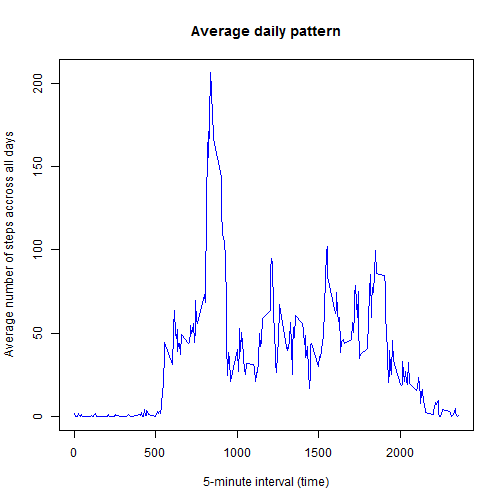
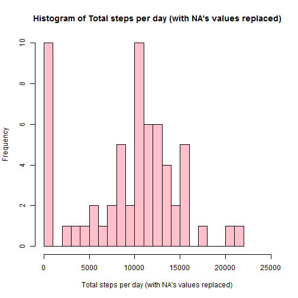
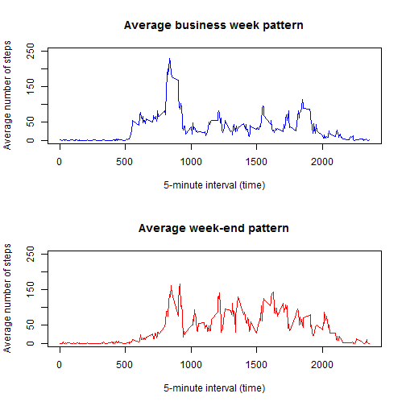

Reproducible Research Peer Assessment Assignment 1
==================================================


## Loading and preprocessing the data

```r
# Load data into activity using read.csv
activity <- read.csv("activity.csv")

# Quick overview of activity
summary(activity)
```

```
##      steps                date          interval     
##  Min.   :  0.00   2012-10-01:  288   Min.   :   0.0  
##  1st Qu.:  0.00   2012-10-02:  288   1st Qu.: 588.8  
##  Median :  0.00   2012-10-03:  288   Median :1177.5  
##  Mean   : 37.38   2012-10-04:  288   Mean   :1177.5  
##  3rd Qu.: 12.00   2012-10-05:  288   3rd Qu.:1766.2  
##  Max.   :806.00   2012-10-06:  288   Max.   :2355.0  
##  NA's   :2304     (Other)   :15840
```


## What is mean total number of steps taken per day?
We sum all steps per day (irrespective of the interval)

```r
# Calculate number of steps per day using tapply (removing any NA's)
TotalStepsPerDay <- tapply(activity$steps, activity$date, sum, na.rm = TRUE)

# Get number of uniqye days (useful later) 
nb_days <- length(TotalStepsPerDay)
nb_days
```

```
## [1] 61
```

```r
# Plot resulting histogram
hist(TotalStepsPerDay, col = "red", breaks = 25,
     xlab = "Total steps per day",
     xlim = c(0, 25000))
```

 

We compute the mean and median values

```r
mean(TotalStepsPerDay)
```

```
## [1] 9354.23
```

```r
median(TotalStepsPerDay)
```

```
## [1] 10395
```

  
## What is the average daily activity pattern?
We average the steps per interval (irrespective of the day)

```r
# Calculate average number of steps per interval using tapply and removing NA's
AverageStepsPerInterval <- tapply(activity$steps, activity$interval, mean, na.rm = TRUE)

# Plot resulting Time Series plot
plot(names(AverageStepsPerInterval), AverageStepsPerInterval, 
     type = "l", 
     col = "blue", 
     main = "Average daily pattern", 
     xlab = "5-minute interval (time)", 
     ylab = "Average number of steps accross all days")
```

 


```r
# Find max of AverageStepsPerInterval
ind_max <- AverageStepsPerInterval == max(AverageStepsPerInterval)
interval_max <- AverageStepsPerInterval[ind_max]
interval_max
```

```
##      835 
## 206.1698
```

The 5-minute interval, on average across all the days in the dataset, which contains the maximum number of steps is: 835
  
  
## Imputing missing values
First let's find the total number of missing values in the dataset:

```r
# Using summary
summary(activity$steps)
```

```
##    Min. 1st Qu.  Median    Mean 3rd Qu.    Max.    NA's 
##    0.00    0.00    0.00   37.38   12.00  806.00    2304
```

```r
# Create logical vector of missing values
missing_values <- is.na(activity$steps)

# Compute length
nb_na <- length(activity$steps[missing_values])
nb_na
```

```
## [1] 2304
```
The number of missing values is: 2304  

We create a new column to activity called steps\_new which will contain the same stesp data but with the missing data filled in. The missing values will be replaced by the AverageStepsPerInterval for that interval. In order to facilitate the replacement process we also create a new column average\_per\_interval which is the vector AverageStepsPerInterval repeated 61 times (see nb_days variable).


```r
activity$steps_new <- activity$steps
activity$average_per_interval <- rep(AverageStepsPerInterval, nb_days)
```

We then loop other each step value and replace any NA by the corresponding average value for that interval


```r
for (i in (1:length(activity$steps))) {
  if (is.na(activity$steps[i])) {
    activity$steps_new[i] <- activity$average_per_interval[i]
  }
}
```

We can then plot the correponding histogram:

```r
TotalStepsPerDay_new <- tapply(activity$steps, activity$date, sum, na.rm = TRUE)

# Plot resulting histogram
hist(TotalStepsPerDay_new, col = "pink", breaks = 25,
     main = "Histogram of Total steps per day (with NA's values replaced)",
     xlab = "Total steps per day (with NA's values replaced)",
     xlim = c(0, 25000))
```

 

We compute the mean and median values

```r
mean(TotalStepsPerDay_new)
```

```
## [1] 9354.23
```

```r
median(TotalStepsPerDay_new)
```

```
## [1] 10395
```


Comparing with the first histogram we see no clear difference which seems normal. We have just replaced the NA's values by average values observed other days and therefore reinforced the average behavior. It's probably better actually in such case to ignore the NA's values and therefore to avoid the imputing process.
   

## Are there differences in activity patterns between weekdays and weekends?
We create new columns to store the day corresponding to the date (using weekdays()) and if that day is in the weekend (default is FALSE)

```r
activity$day <- weekdays(as.Date(activity$date))
activity$weekend <- rep(FALSE, length(activity$date))

# for each row, we then check if day is a weekend day and modify the flag accordingly.
for (i in (1:length(activity$date))) {
  if ((activity$day[i] == "Saturday") | (activity$day[i] == "Sunday")) {
    activity$weekend[i] <- TRUE
  } 
}
```

We split the activity in two new datasets based on the weekend boolean and we compute the average steps for each interval for each of these new datasets:

```r
activity_weekend <- activity[activity$weekend == TRUE, ]
AverageStepsPerInterval_weekend <- tapply(activity_weekend$steps_new, 
                                          activity_weekend$interval, mean, 
                                          na.rm = TRUE)


activity_week <- activity[activity$weekend == FALSE, ]
AverageStepsPerInterval_week <- tapply(activity_week$steps_new, 
                                       activity_week$interval, mean, 
                                       na.rm = TRUE)
```

Now we can plot the average pattern during the week (business days) and during the week-end:

```r
par(mfcol = c(2, 1))

# Plot resulting Time Series plot for the week
plot(names(AverageStepsPerInterval_week), AverageStepsPerInterval_week, 
     type = "l", 
     col = "blue", 
     ylim = c(0, 250),
     main = "Average business week pattern", 
     xlab = "5-minute interval (time)", 
     ylab = "Average number of steps")

# Plot resulting Time Series plot for the week-end
plot(names(AverageStepsPerInterval_weekend), AverageStepsPerInterval_weekend, 
     type = "l", 
     col = "red", 
     ylim = c(0, 250),
     main = "Average week-end pattern", 
     xlab = "5-minute interval (time)", 
     ylab = "Average number of steps")
```

 
  
We can clearly see differences between two datasets: Early activity during the week with peak around 8-9h (going to work) and then less activity (few peaks probably corresponding to lunch hours and end of works hours).
During the weekend the activity is more spread during the days (no office hours for most of people)
