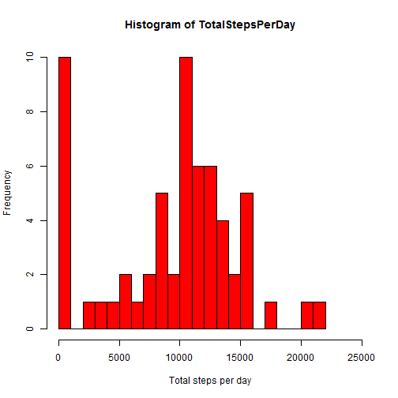

## Loading and preprocessing the data

```r
# Load data into activity using read.csv
activity <- read.csv("activity.csv")

# Quick overview of activity
summary(activity)
```

```
##      steps                date          interval     
##  Min.   :  0.00   2012-10-01:  288   Min.   :   0.0  
##  1st Qu.:  0.00   2012-10-02:  288   1st Qu.: 588.8  
##  Median :  0.00   2012-10-03:  288   Median :1177.5  
##  Mean   : 37.38   2012-10-04:  288   Mean   :1177.5  
##  3rd Qu.: 12.00   2012-10-05:  288   3rd Qu.:1766.2  
##  Max.   :806.00   2012-10-06:  288   Max.   :2355.0  
##  NA's   :2304     (Other)   :15840
```


## What is mean total number of steps taken per day?

```r
# Calculate number of steps per day using tapply and removing NA's
TotalStepsPerDay <- tapply(activity$steps, activity$date, sum, na.rm = TRUE)

# Plot resulting histogram
hist(TotalStepsPerDay, col = "red", breaks = 25,
     xlab = "Total steps per day",
     xlim = c(0, 25000))
```

 


We compute the mean and median values

```r
mean(TotalStepsPerDay)
```

```
## [1] 9354.23
```

```r
median(TotalStepsPerDay)
```

```
## [1] 10395
```
  
## What is the average daily activity pattern?
  

```r
# Calculate average number of steps per interval using tapply and removing NA's
AverageStepsPerInterval <- tapply(activity$steps, activity$interval, mean, na.rm = TRUE)

# Plot resulting Time Series plot
plot(names(AverageStepsPerInterval), AverageStepsPerInterval, 
     type = "l", 
     col = "blue", 
     main = "Average daily pattern", 
     xlab = "5-minute interval (time)", 
     ylab = "Average number of steps accross all days")
```

 


```r
# Find max of AverageStepsPerInterval
ind_max <- AverageStepsPerInterval == max(AverageStepsPerInterval)
interval_max <- AverageStepsPerInterval[ind_max]
interval_max
```

```
##      835 
## 206.1698
```

The 5-minute interval, on average across all the days in the dataset, which contains the maximum number of steps is: 835
  
  
## Imputing missing values
First let's find the total number of missing values in the dataset:

```r
# Using summary
summary(activity$steps)
```

```
##    Min. 1st Qu.  Median    Mean 3rd Qu.    Max.    NA's 
##    0.00    0.00    0.00   37.38   12.00  806.00    2304
```

```r
# Create logical vector of missing values
missing_values <- is.na(activity$steps)

# Compute length
nb_na <- length(activity$steps[missing_values])
nb_na
```

```
## [1] 2304
```
The number of missing values is: 2304  

We create a new dataset which will contain the same data than activity but with the missing data filled in
   
   

## Are there differences in activity patterns between weekdays and weekends?


